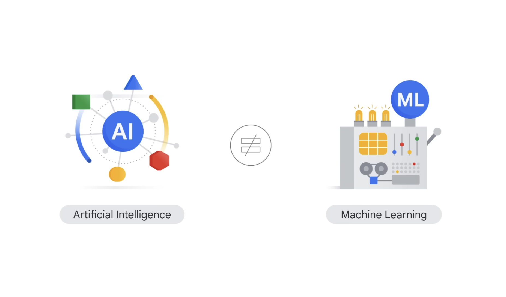
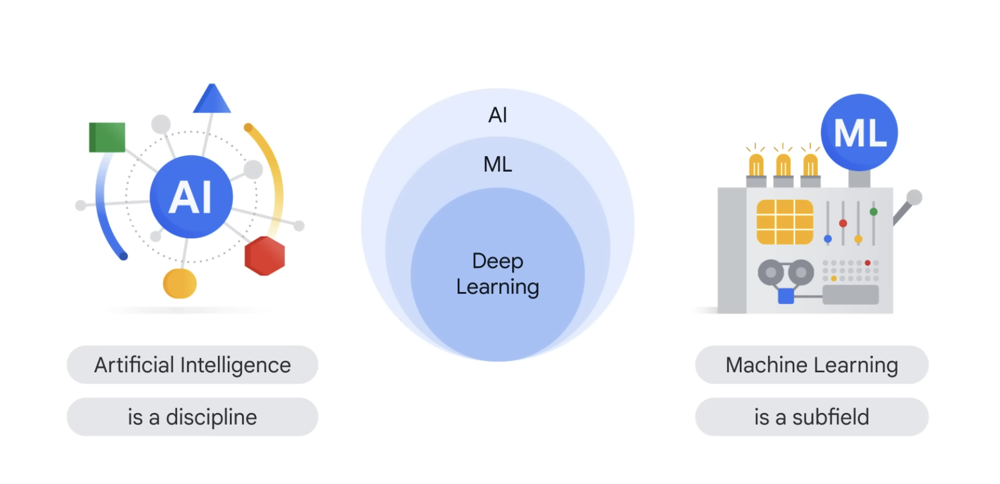
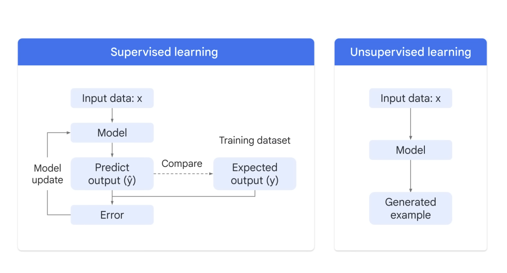
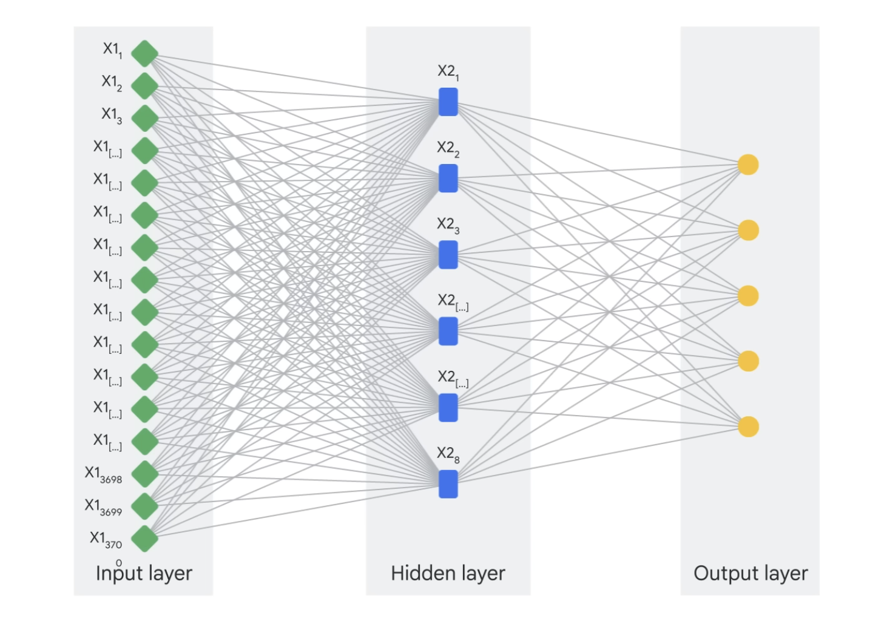

## Generative AI
::: {.callout-tip}
Topic Modeling dalam Generative AI merupakan bagian dari evolusi NLP.
:::

>Pada dasarnya, hubungan keduanya bisa dilihat dari dua sudut pandang:

::: {.callout-caution collapse="false"}
Topic Modeling Klasik (seperti LDA) adalah Bentuk Awal dari Generative AI.
:::

::: {.callout-caution collapse="false"}
Generative AI Modern (seperti LLMs) adalah Evolusi Canggih dari Topic Modeling.
:::

## Generative AI

## Generative AI

## Perbedaannya
| Aspek              | Topic Modeling Klasik (LDA, NMF)                                                    | Generative AI Modern (LLMs)                                                                                                                  |
| :----------------- | :---------------------------------------------------------------------------------- | :------------------------------------------------------------------------------------------------------------------------------------------- |
| **Cara Kerja** | Statistik & Probabilistik. Mencari pola kemunculan kata bersama (*co-occurrence*).    | *Deep Learning* & Kontekstual. Memahami makna kalimat dan paragraf secara mendalam.                                                          |

## Perbedaannya
| Aspek              | Topic Modeling Klasik (LDA, NMF)                                                    | Generative AI Modern (LLMs)                                                                                                                  |
| :----------------- | :---------------------------------------------------------------------------------- | :------------------------------------------------------------------------------------------------------------------------------------------- |
| **Output** | Daftar kata kunci per topik. Contoh: `Topik 1: [kucing, makanan, bulu, mainan]`      | Deskripsi naratif dan label topik yang koheren. Contoh: `Topik 1: Perawatan Kucing Peliharaan`                                                |

## Perbedaannya
| Aspek              | Topic Modeling Klasik (LDA, NMF)                                                    | Generative AI Modern (LLMs)                                                                                                                  |
| :----------------- | :---------------------------------------------------------------------------------- | :------------------------------------------------------------------------------------------------------------------------------------------- |
| **Interpretasi** | Membutuhkan manusia untuk menafsirkan arti dari sekumpulan kata kunci.              | Model dapat langsung memberikan nama atau ringkasan topik yang mudah dipahami.                                                               |

## Perbedaannya
| Aspek              | Topic Modeling Klasik (LDA, NMF)                                                    | Generative AI Modern (LLMs)                                                                                                                  |
| :----------------- | :---------------------------------------------------------------------------------- | :-------------------------------------------------------------------------------------------------------------------------------------------                                            |
| **Fleksibilitas** | Terbatas untuk menemukan topik.                                                     | Sangat fleksibel. Bisa melakukan *topic modeling*, meringkas, menjawab pertanyaan tentang topik, bahkan membuat dokumen baru berdasarkan topik tersebut. |

## Generative AI

## Generative AI
